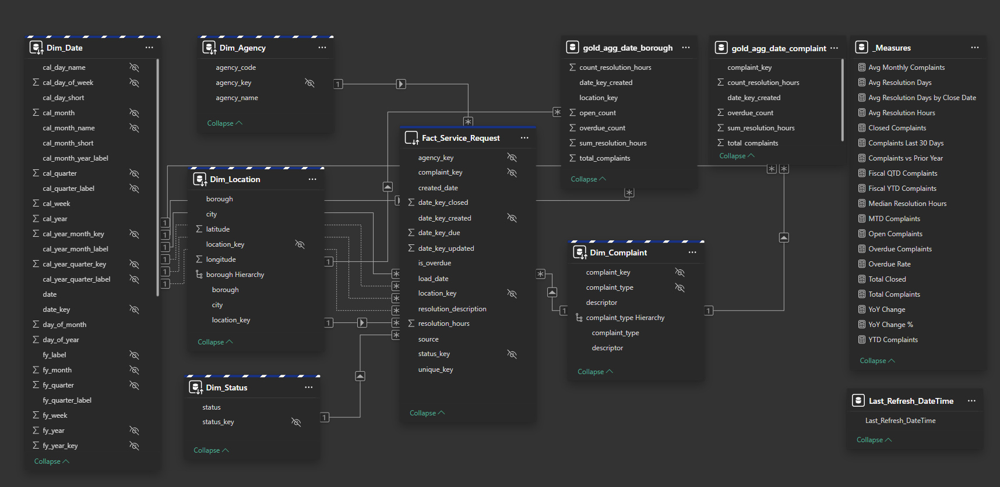

# 🗽 NYC311 — Fabric Data Platform & Power BI Dashboard

## 📌 Overview

An end-to-end data platform built on Microsoft Fabric analyzing New York City 311 Service Requests. The project covers the complete lifecycle from incremental API ingestion through a medallion Lakehouse architecture to a mixed-mode Power BI semantic model with pre-materialized aggregation tables and an interactive multi-page dashboard.

This project serves as the primary applied demonstration for the **PL-300** certification and lays the architectural groundwork for **DP-600** (Fabric Analytics Engineer).

**Dataset:** NYC 311 Service Requests — approximately 35M+ records spanning multiple years of city service activity across all five boroughs.
**Source:** [NYC Open Data](https://data.cityofnewyork.us)
**API Endpoint:** `https://data.cityofnewyork.us/resource/erm2-nwe9.json`

The platform answers:
- Where and when are service requests concentrated across NYC boroughs?
- Which agencies handle the highest complaint volumes and resolve them fastest?
- What complaint types are trending up or down over time?
- How has resolution performance and SLA compliance changed year-over-year?

---

## 🧩 Architecture

The platform runs in a single Microsoft Fabric workspace (`NYC311-Fabric`) and uses a Fabric-native pipeline to orchestrate the full data flow from API to report.

```
NYC Open Data 311 API (Socrata)
        │  incremental, watermark-based
        ▼
[ Bronze ] Raw Delta tables — NYC311_Lakehouse
        │  Ingest_API_Live notebook
        ▼
[ Silver ] Cleansed, typed, deduplicated
        │  Transform_Bronze_to_Silver notebook
        ▼
[ Gold  ] Dim + Fact + Aggregation tables
        │  Transform_Silver_to_Gold notebook
        ▼
SQL Analytics Endpoint (NYC311_Lakehouse)
        │
        ▼
Power BI Semantic Model
  ├── Dim_Date, Dim_Agency, Dim_Location,
  │   Dim_Status, Dim_Complaint     → Dual mode
  ├── Fact_Service_Request          → DirectQuery
  └── gold_agg_date_borough,
      gold_agg_date_complaint       → Import mode
        │
        ▼
NYC311 Power BI Report
```

**Deployment** is managed through a Fabric-native pipeline (Dev → Test → Production) with mandatory reviewer approval at each stage transition. Source control uses a Git feature branch workflow with PR-gated merges to `main`.

Full platform documentation: [`../../docs/lakehouse-architecture.md`](../../docs/lakehouse-architecture.md)

---

## 📊 Data Model



### Fact Table — `Fact_Service_Request` (DirectQuery)

| Column | Description |
|--------|-------------|
| `unique_key` | Source system complaint identifier |
| `agency_key` | FK → Dim_Agency |
| `complaint_key` | FK → Dim_Complaint |
| `location_key` | FK → Dim_Location |
| `status_key` | FK → Dim_Status |
| `date_key_created` | FK → Dim_Date (created date) |
| `date_key_closed` | FK → Dim_Date (closed date) |
| `date_key_due` | FK → Dim_Date (SLA due date) |
| `date_key_updated` | FK → Dim_Date (resolution updated date) |
| `created_date` | Raw created datetime (for time calculations) |
| `resolution_hours` | Calculated resolution duration in hours |
| `is_overdue` | Boolean SLA breach flag |
| `resolution_description` | Closing resolution text |
| `source` | Data source indicator |
| `load_date` | Pipeline load timestamp for lineage |

### Dimension Tables (Dual Mode)

**`Dim_Date`** — Full calendar and fiscal year attributes including `cal_year_month_key`, `cal_year_quarter_key`, `fy_year`, `fy_quarter`, `fy_month`, `fy_week`, and display labels. Supports four date role relationships on the fact table (created, closed, due, updated).

**`Dim_Agency`** — `agency_key`, `agency_code`, `agency_name`

**`Dim_Location`** — `location_key`, `borough`, `city`, `latitude`, `longitude`. Includes a **Borough Hierarchy** (borough → city → location_key) for drill-down navigation.

**`Dim_Complaint`** — `complaint_key`, `complaint_type`, `descriptor`. Includes a **Complaint Type Hierarchy** (complaint_type → descriptor) for category drill-down.

**`Dim_Status`** — `status_key`, `status`

### Aggregation Tables (Import Mode)

Pre-materialized at the Gold layer in the Lakehouse as part of the `Transform_Silver_to_Gold` notebook execution.

**`gold_agg_date_borough`** — aggregated by `date_key_created` × `location_key`
- `total_complaints`, `open_count`, `overdue_count`, `sum_resolution_hours`, `count_resolution_hours`

**`gold_agg_date_complaint`** — aggregated by `date_key_created` × `complaint_key`
- `total_complaints`, `overdue_count`, `sum_resolution_hours`, `count_resolution_hours`

### Supporting Tables

**`_Measures`** — dedicated measure table (leading underscore sorts it to the top of the field list). Contains all 19 report measures. No columns, no rows — measures only.

**`Last_Refresh_DateTime`** — single-column table tracking the most recent pipeline refresh timestamp, surfaced in the report footer.

---

## 🧠 DAX Measures

All 19 measures are housed in the `_Measures` table. Full definitions in [`./dax/measures.md`](./dax/measures.md).

**Volume & Status**
- `Total Complaints` — base complaint count
- `Open Complaints` — complaints with open status
- `Closed Complaints` — complaints with closed status
- `Total Closed` — closed complaint count variant
- `Overdue Complaints` — complaints past SLA due date
- `Overdue Rate` — overdue complaints as a percentage of total
- `Complaints Last 30 Days` — rolling 30-day window

**Time Intelligence**
- `YTD Complaints` — year-to-date using calendar year
- `Fiscal YTD Complaints` — year-to-date using fiscal year
- `Fiscal QTD Complaints` — fiscal quarter-to-date
- `MTD Complaints` — month-to-date
- `YoY Change` — absolute year-over-year variance
- `YoY Change %` — percentage year-over-year variance
- `Complaints vs Prior Year` — prior year comparison value

**Resolution Performance**
- `Avg Resolution Hours` — average resolution duration across closed complaints
- `Avg Resolution Days` — resolution hours converted to days
- `Avg Resolution Days by Close Date` — resolution performance anchored to close date
- `Median Resolution Hours` — median resolution duration
- `Avg Monthly Complaints` — average monthly volume for trend benchmarking

---

## 📈 Visuals & Report Pages

**Page 1 — Executive Summary**
- KPI cards: Total Complaints, Open Complaints, Overdue Rate, Avg Resolution Days
- Monthly complaint volume trend with YoY overlay
- Top complaint types (bar chart)
- Borough breakdown (map + bar)

**Page 2 — Agency Performance**
- Agency volume and overdue rate comparison
- Avg Resolution Days by agency
- Drill-through to complaint-level detail

**Page 3 — Geographic Analysis**
- Map visual using Dim_Location latitude/longitude
- Borough Hierarchy drill-down
- Complaint type concentration by area

**Page 4 — Trend Analysis**
- YTD, QTD, MTD complaint volume
- YoY Change % trend line
- Complaint Type Hierarchy drill-down
- Submission channel and status breakdowns

---

## 🔧 Tooling

**DAX Studio** — used to validate aggregation table hit rates and diagnose DirectQuery fallback by inspecting query plans and server timings against the semantic model's Analysis Services endpoint.

**Tabular Editor 3** — used for bulk DAX measure authoring across the `_Measures` table, Best Practice Analyzer runs, TMDL review of Git-serialized model definitions, and annotation management via XMLA endpoint.

**Power BI Desktop (PBIP format)** — the `.pbip` project format enables Git-friendly version control of the report and semantic model as readable JSON and TMDL files rather than opaque `.pbix` binary.

---

## 📂 Folder Structure

```
powerbi-nyc311/
├── reports/                                            ← Power BI project files
│   ├── NYC_311_Service_Requests_Dashboard.pbip
│   ├── NYC_311_Service_Requests_Dashboard.Report/
│   │   ├── definition.pbir
│   │   └── definition/
│   │       ├── report.json
│   │       └── pages/
│   └── NYC_311_Service_Requests_Dashboard.SemanticModel/
│       ├── definition.pbism
│       ├── diagramLayout.json
│       └── definition/
│           ├── model.tmdl
│           ├── database.tmdl
│           ├── relationships.tmdl
│           ├── tables/
│           └── cultures/
├── dax/
│   └── measures.md                                     ← Full DAX measure library
├── docs/
│   └── data_dictionary.md                              ← Source column definitions
├── screenshots/
│   ├── NYC311-model-diagram.png                        ← Semantic model view
│   ├── 01_overview_dashboard.png
│   ├── 02_agency_performance.png
│   ├── 03_geographic_analysis.png
│   ├── 04_trend_analysis.png
│   ├── 05_dax_measure_example.png
│   └── 06_power_query_steps.png
└── README.md
```

---

## 🚀 How to Use / Demo

**To open the report and semantic model locally:**
1. Clone the repository and open `reports/NYC_311_Service_Requests_Dashboard.pbip` in Power BI Desktop with PBIP format enabled (Options → Preview Features → Store semantic model using enhanced metadata format)
2. The semantic model connects to the `NYC311_Lakehouse` SQL analytics endpoint in the Fabric workspace — a Fabric PPU or trial license is required to connect to the live environment
3. For local exploration without a Fabric workspace, the M query in the semantic model partition can be redirected to query the NYC Open Data API directly

**To review the semantic model definition:**
Open any `.tmdl` file in the `reports/NYC_311_Service_Requests_Dashboard.SemanticModel/definition/` folder in Tabular Editor 3 or a text editor. The `model.tmdl`, `relationships.tmdl`, and `tables/*.tmdl` files contain the complete model definition in readable format.

---

## 🎓 Related Certifications

| Certification | Status | Alignment |
|---|---|---|
| PL-900 — Power Platform Fundamentals | ✅ 2025 | Platform foundation |
| PL-300 — Power BI Data Analyst Associate | 🎯 Active | Semantic model, DAX, visualization, aggregations |
| DP-600 — Fabric Analytics Engineer Associate | 📋 Planned | Lakehouse, medallion architecture, pipeline orchestration |

---

## 📝 Lessons Learned

**Aggregation matching requires exact schema alignment between Lakehouse and semantic model.** Column names, data types, and measure names in the Gold agg tables must match the semantic model's aggregation configuration precisely. Mismatches fail silently — the engine falls back to DirectQuery without raising an error. DAX Studio server timings are the only reliable diagnostic.

**Dual mode is the correct choice for dimensions in a mixed-mode model.** Testing Import-only dimensions caused storage mode conflicts when aggregation queries needed to join dimension values to DirectQuery partitions. Switching to Dual resolved this cleanly and is the default approach for any dimension table in a DQ-backed model.

**TMDL format makes semantic model changes genuinely reviewable.** Before enabling PBIP/TMDL, model changes were opaque binary diffs in `.pbix` files. TMDL surfaces measure definitions, storage modes, and relationship configurations as readable text — PR reviews of model changes became substantive rather than ceremonial.

**Incremental watermark logic must be placed after a confirmed successful write.** Early iterations advanced the watermark before confirming the Delta write had committed, resulting in skipped records on retry. Moving the watermark update to the final step of a successful notebook run made the pipeline fully idempotent.

**A dedicated `_Measures` table with a leading underscore is worth establishing from the start.** It keeps all measures organized, sorts the table to the top of the field list, and prevents measures from scattering across fact and dimension tables as the model grows.

---

## 🔗 Links

- [NYC Open Data — 311 Service Requests](https://data.cityofnewyork.us/Social-Services/311-Service-Requests-from-2010-to-Present/erm2-nwe9)
- [GitHub Repository](https://github.com/joshuawozny/cloud-powerplatform-portfolio)
- [Lakehouse Architecture](../../docs/lakehouse-architecture.md)
- [Fabric Environment Setup](../../01-power-platform/docs/fabric-environment-setup.md)
- [Fabric Pipeline Orchestration](../../04-devops/docs/fabric-pipeline.md)
