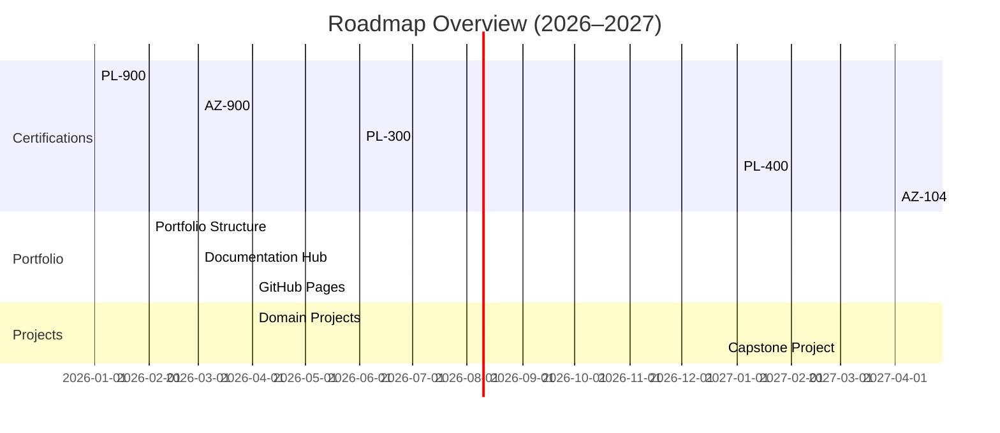

# **Professional Development Roadmap (2026–2027)**

I maintain a structured, multi‑year roadmap to guide my growth as a Cloud & Power Platform Engineer. My focus is on building enterprise‑grade solutions, strengthening Azure and DevOps capabilities, and developing a portfolio that reflects real‑world engineering standards.

---

## **2026: Foundation & Infrastructure**

### **Core Certifications**
- **PL‑900 – Power Platform Fundamentals**  
- **AZ‑900 – Azure Fundamentals**  
- **PL‑300 – Power BI Data Analyst**

Each certification includes a corresponding portfolio project demonstrating applied skills, architecture, and documentation.

### **Portfolio Architecture & Standards**
- Multi‑folder GitHub portfolio with clear hierarchy  
- Standards hub (file naming, Azure resource naming, Power Platform solution/table naming, DevOps pipeline naming)  
- GitHub Pages site for public presentation  
- Issue/PR templates to mirror enterprise engineering workflows  

### **Applied Projects**
Hands‑on projects across:
- Power Platform (Apps, Flows, Dataverse)  
- Azure Administration (Compute, Storage, Identity, Networking)  
- DevOps (CI/CD, YAML pipelines, IaC)  
- Data Analytics (Power BI, Power Query, DAX)  

Each project includes architecture diagrams, documentation, testing notes, and lessons learned.

---

## **2027: Specialization & Leadership**

### **Role‑Based Certifications**
- **PL‑400 – Power Platform Developer**  
- **AZ‑104 – Azure Administrator**  
- **AZ‑204 or AZ‑700** (based on specialization path)  
- **PMP Eligibility** through completion of Master of IT program  

### **Flagship Capstone Project**
A full enterprise solution integrating:
- Azure services  
- Power Platform  
- CI/CD pipelines  
- Monitoring & governance  
- Security & identity  
- Agile/PMP documentation  
- Architecture diagrams (current, future, data flow, component map)

### **Career Positioning**
- Updated resume aligned to cloud/Power Platform engineering roles  
- LinkedIn narrative reflecting technical progression  
- Case studies for major portfolio projects  
- Scenario‑based interview preparation  

---

## **Long‑Term Goals**
- Transition into a cloud‑focused technical role by mid‑2027  
- Position for Senior/Lead roles by end of 2027  
- Build a portfolio demonstrating enterprise‑level engineering, documentation, and architectural thinking  

---

## **Roadmap Timeline (High‑Level)**

---  
