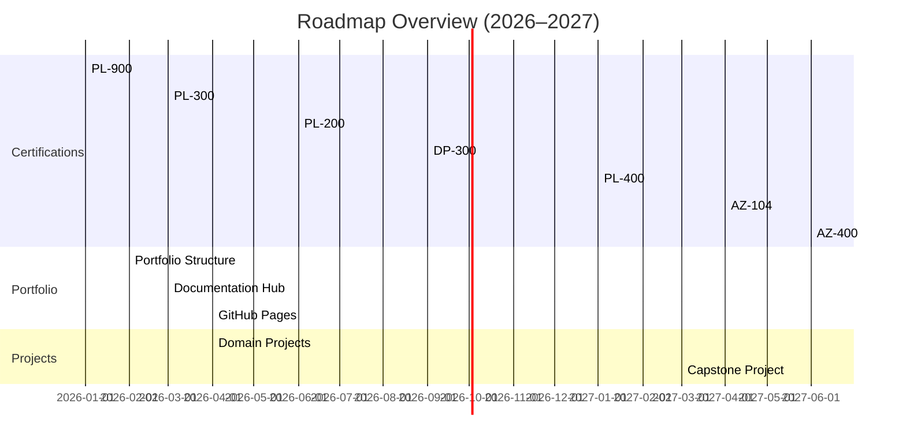

# Professional Development Roadmap (2026–2027)

I maintain a structured, multi-year roadmap to guide my growth as a Cloud & Power Platform Engineer. My focus is on building enterprise-grade solutions, strengthening Azure and DevOps capabilities, and developing a portfolio that reflects real-world engineering standards.

---

## 2026: Foundation & Platform Depth

### Core Certifications

- **PL-900 – Power Platform Fundamentals** ✅ *2025*
- **PL-300 – Power BI Data Analyst Associate** 🎯 *Active*
- **PL-200 – Power Platform Functional Consultant Associate** *Planned Q3 2026*

Each certification includes a corresponding portfolio project demonstrating applied skills, architecture, and documentation.

### Portfolio Architecture & Standards

- Multi-folder GitHub portfolio with clear hierarchy
- Standards hub (file naming, Azure resource naming, Power Platform solution/table naming, DevOps pipeline naming)
- GitHub Pages site for public presentation
- Issue/PR templates to mirror enterprise engineering workflows

### Applied Projects

Hands-on projects across:

- Power Platform (Apps, Flows, Dataverse)
- Microsoft Fabric (Lakehouse, Pipelines, Notebooks)
- Data Analytics (Power BI, Power Query, DAX, semantic model design)
- DevOps (Git workflows, Fabric deployment pipelines, CI/CD)

Each project includes architecture diagrams, documentation, testing notes, and lessons learned.

---

## 2027: Specialization & Leadership

### Role-Based Certifications

- **DP-300 – Azure Database Administrator Associate**
- **PL-400 – Power Platform Developer**
- **AZ-104 – Azure Administrator Associate**
- **AZ-400 – Azure DevOps Engineer Expert**
- **PMP Eligibility** through completion of Master of IT program (expected 2026)

### Flagship Capstone Project

A full enterprise solution integrating:

- Azure services
- Power Platform
- Microsoft Fabric
- CI/CD pipelines
- Monitoring & governance
- Security & identity
- Agile/PMP documentation
- Architecture diagrams (current, future, data flow, component map)

### Career Positioning

- Updated resume aligned to cloud/Power Platform engineering roles
- LinkedIn narrative reflecting technical progression
- Case studies for major portfolio projects
- Scenario-based interview preparation

---

## Long-Term Goals

- Transition into a cloud-focused technical role by mid-2027
- Position for Senior/Lead roles by end of 2027
- Build a portfolio demonstrating enterprise-level engineering, documentation, and architectural thinking

---

## Roadmap Timeline (High-Level)

---

## 🔗 Links

- [GitHub Repository](https://github.com/joshuawozny/cloud-powerplatform-portfolio)
- [01-power-platform](../01-power-platform/)
- [03-data-analytics](../03-data-analytics/)
- [04-devops](../04-devops/)
